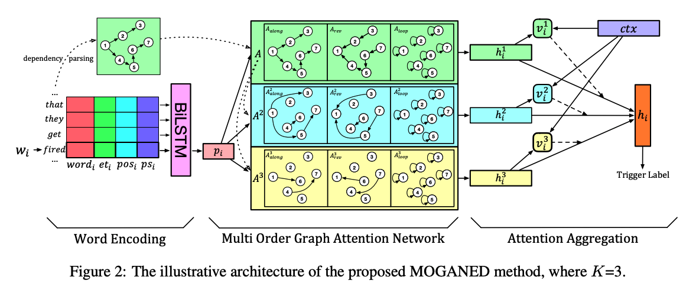
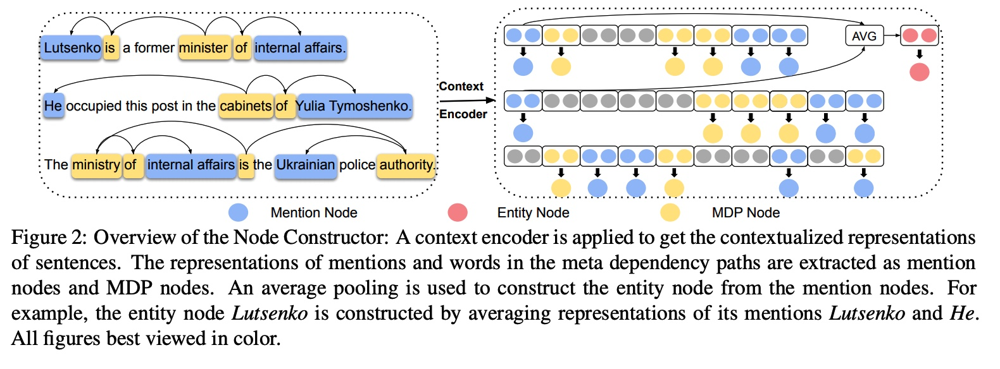
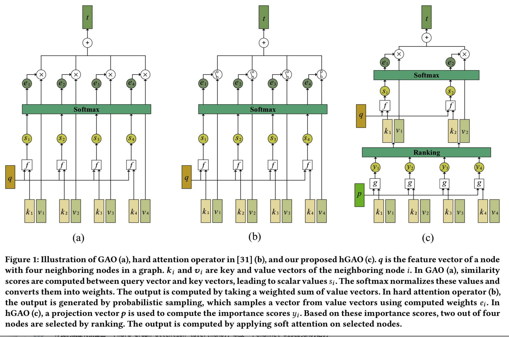
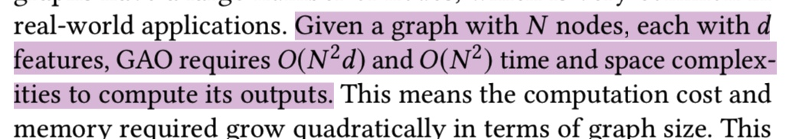
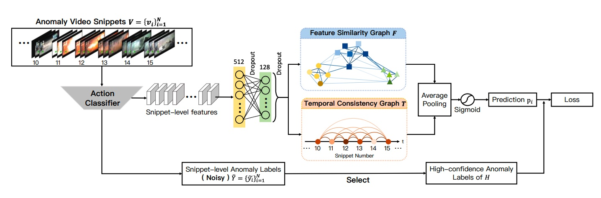
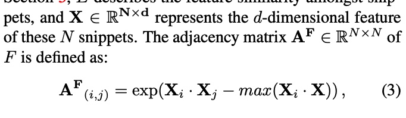
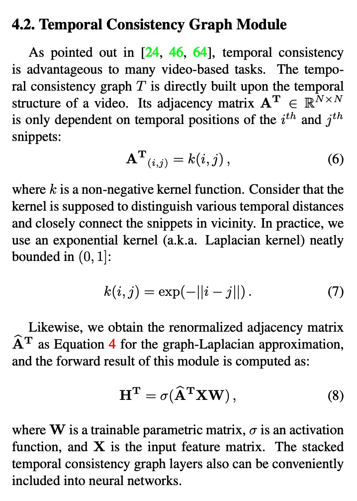
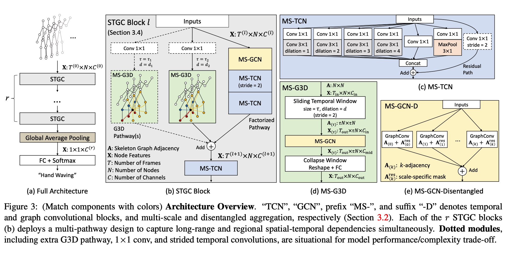
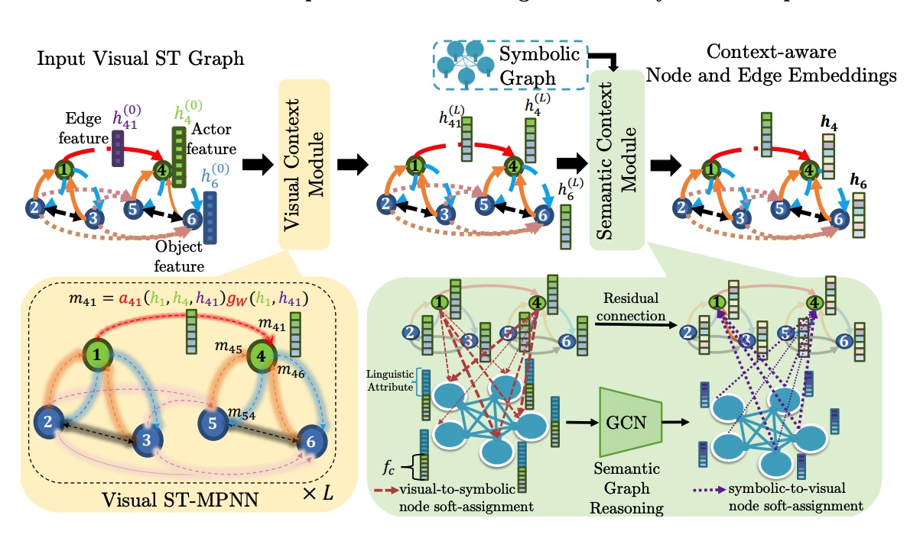

# In the following discussions, we will skip linear transformations for the sake of notational simplicity~
# awesome-GNN
关于图神经网络的一些工作总结

## 图神经网络的更新方式除了一下全部aggregate以外，还可以按照分阶段来处理。
比如知识图谱我可以把每个三元组的进行bilinear。然后使用attention来搞。

# 1.Hypergraph Neural Networks@AAAI2020
high-order data correlation(更加flexible)
## Motivation:
1.主要就是high-order data correlation@

## 我们的技术核心创新
1.传统的hypergraph learning过程可以通过本文提出的hyperedge convolution进行优化～

## introduction介绍方式
就是说传统的gcn就是pairwise connections among data are employed，但是事实上data structure in real practice could be beyond pairwise connections and even far more complicated。

尤其是针对多模态数据，整个情形就会变得更佳复杂。

1.data correlation比起pairwise relaionship而言是很复杂的。

2.而且对于异质信息网络而言，传统的GCN就有它的limitation to formulate the data correlation；

3.咱们的HGNN比起传统的edge degree@mandatory 2，我们的可以encode high-order data correlation。

4.hypergraph在cv中很常见，但是由于其很高的计算量，所以wide application就limited了。

GCN可以看作是HGNN的一个special case。


### TODO 这里的公式太spectral了

# 2.Hypergraph Attention Networks for Multimodal Learning
## 1.Motivation:
1.在这个传统的过程中，我们表示align the information level of 异质模态是一个基础的任务@多模态学习

2。我们这里就是创建hypergraph来学习alignment～


# 3.Event Detection with Multi-order Graph Convolution and Aggregated Attention
这里的核心就是找到一个event trigger（main word to the 对应的event，依靠这个词就可以分类出这个话到底是什么类型的event，比如fired就是attack）
## Motivation:
1.这里就是前人工作使用的dependency tree的话，就是trigger words和related entities的syntactic relations可能是first-order的，也可能是high-order的。而且，据统计，51%的是高order的。

2.虽然目前的使用high-order都是stack more GCN layers。但是事实上oversmooth就有问题。那么我们搞几个～

3.我们就是同时使用first-order和high-order的graph来encoding，其中使用GAT来自适应决定邻居words的weight～

## 工作内容
### 1.Word Encoding
word embedding+entity type embedding+POStagging embedding

BiLSTM
### 2.Multi-order graph attention network
首先关于A有三个sub matrixs，他们的shape都是nxn的，Aalong,Arev,Aloop. along呢，就是如果这儿在dependency tree中有dependency arc的话，就有1@Aalong。Arev就是Aalong的转置矩阵～
Aloop就是identity matrix。

然后咱们这里额外搞了几个k-th order syntactic graph。就是edge仍然是三种，不过along的就是变成了之前的k-order。


计算的时候就是GAT自适应学习，然后element-addition就行～那么我们这里设置的K=3.



# 3. Learning Multi-Granular Hypergraphs for Video-Based Person Re-id
### introduction介绍方式
this work aims to .In this sense.

对于person re-id而言，multi-granular的spatial relation和multi-granular 的temporal relation都是十分重要的～

# 4. Sentence Specified Dynamic Video Thumbnail Generation
Video Thumbnail 就是和视频摘要差不多～

Video Thumbnail Generation就是产生video content preview预演，这个对于影响users' online searching experiences~

这里就是提出一个新任务。不仅是生成Video Summarization还要针对用户的个人兴趣来自动生成～（多模态）
## 1.Motivation:
1.传统的video thumbnail仅仅只是利用了视觉特征@video，而没有user的搜索意图不能提供一个有意义的snapshot简介 of the video contents that users concern.

2.我们提出的模型GTP就是利用sentence specified video graph convolutional network@建模both 句子-视频 语义interaction以及内部的视频关系@结合sentence information。（基于temporal conditioned pointer network）（就是一种graph之前做了一个匹配的操作～）

# 5. Temporal Dynamic Graph LSTM for Action-driven Video Object Detection@TD-GraphLSTM

# 6. Object-Aware Multi-Branch Relation Networks for Spatio-Temporal Video Grounding
## 1.Motivation
1.许多现有的Grounding work都是局限于well-aligned segment-sentence pairs～那么我们的工作就是unaligned data and multi-form sentences.

2.这个任务就是需要capture重要的object relations去identify the queried target.

3.但是现有的办法无法区分出notable objects以及关系建模还不是那么有效@针对不重要的对象～

## 2.我们的Contributions@我们提出一个创新性的object-aware multi-branch relation network@object-aware relation discovery.
1.我们就是设计了multiple branches去发展object-aware region modeling（每个branch都关注一个crucial object in 句子）

2.然后我们就是提出一个multi-branch relation reasoning去捕捉关键object 关系@main branch以及附属branches～

3.除此以外，我们使用了一个diversity loss去确保每个branch只关注自己应该关注的corresponding objects。

# 7.Zero-Shot Video Object Segmentation via Attentive Graph Neural Networks
这里就是一个全连接图，然后relations between 绝对frame pairs作为边～

这个潜在的对关系就是使用注意力机制来进行迭代更新

实验结果证明我们的网络可以发现到常见的对象objects


# 8.Reasoning with Latent Structure Refinement for Document-Level Relation Extraction
## 本文基于的工作
文档级别的关系抽取就需要集中信息within and across多个句子@document，然后捕捉句子之间的entity之间的复杂的交互～

但是有效聚合文档中的相关信息是一个很有挑战性的研究问题～

## Motivation:
1.现有的static document-level的graphs往往基于语法树，co-references 或者heuristics from the unstructured text去建模依赖～（co-reference指代，heuristic启发性的）

2.但是这种类型的方法往往不能捕获rich non-local interactions@inference～

这种问题就是entity和enity的关系理解需要理解几句话，并且进行相应的multi-step reasoning～

## 关于我们如何创建这个node～



# 9.Temporal Relational Modeling with Self-Supervision for Action Segmentation@AAAI2021 对video中的所有frame都进行建模的一种方法～
## 1.Motivation:
1.GCN在视频中关系建模有很大的意义，但是事实上对于long video sequences而言使用GCN还是很苦难的～（主要的原因就是**large number of video frames@nodes让GCN很难caoture and model temporal relations in videos**）（本文的设计就是DTGRM@Dilated Temporal Graph Reasoning Module）

2.我们的方法就是可以model temporal relations and dependencies between video frames **at various time spans**.

我们这里就是multi-level dilated temporal graphs where the nodes代表frames from 不同的moments in videos～（而且这里还有一个**auxiliary self-supervised task is proposed to find and correct wrong temporal relations in videos**）

这里呢其实就是旨在temporally locating以及识别human action segments in long untrimmed videos～**对于action understanding而言，这是一个更加challenging的task**

## Introduction@claim
首先介绍了一下human action understanding这个任务的意义，然后介绍了什么是action segmentation，接着就是讲了一下目前action segmentation的一些工作，指出其实对于action segmentation而言，**In fact, temporal relations in various timescales (i.e., short-term and long-term timescales) are all of importance to infer action label of each frame**

1.因此我们需要一个various timescales的temporal relation建模～

2.那么我们就提出了一个Dilated Temporal Graph Reasoning Module**DTGRM**,同时这里为了增强这个temporal reasoning ability of the proposed model，我们还可以使用一个附属的self-supervised task去识别wrong-ordered frames in video and predict the correct action labels for them.

-multi-level dilated temporal graphs on video frames去effectively model temporal relations@各种各样的timescale。然后计算两种complementary edge weights去指导temporal relational reasoning with GCNs.
-An auxiliary self-supervised task is proposed to enforce the proposed model focus on temporal relational reasoning.@(alleviate the over-fitting)~

## Action Segmentation是什么样的任务呢？
这里的核心就是我们针对T frames的每个frame都要做一个分类，有的类别属于background class(no action)~


## 关于Dilated Temporal Graph Reasoning Module
以前的工作一般是专注于基于action proposals或者action segments来创建graph（**这里一般是基于其他模型进行pre-computed以及mostly inaccurate**）
-那么我们的工作就是直接用frame来进行建模，对于这个large graph的问题使用multi-level dilated temporal graphs。

1.这里的就是说successive frames总是belong to the same action class and long-range temporal relations就是不同的action class之间的关系～

2.但是直接在所有的frames上进行训练以及优化是十分困难的。

### 创建方法
Suppose we have a total of T frames in video and the dilated temporal graphs at k-th level就是基于dilation factor t_k来进行construct的。那么对于timestep t，它的dilated 邻居frames就是被当作是temporal graph的node了，然后vertices就是3.**（t-t_k,t,t+t_k）**

我们的核心就是创建一个3张frame构成的graph，然后对于k-th level我们就是为了减轻noise problem in single constructed graph，我们计算了两个互补的edge weights@dilated temporal graph～(S-Graph + L-Graph)

### S-Graph
创建这个的核心思想就是nodes with similar action class的应该有larger edge weights。因此我们可以首先使用1个1x1的卷积层来transfer action class

# 10.Spatial-aware Graph Relation Network for Large-scale Object Detection
如果正确编码high-order object relation@而并没有利用到任何的外来的knowledge。
如果利用信息between co-occurrence以及locations of objects去进行更好的推理～

## Motivation:
1.distilling关键关系@(可能影响object识别的是非常重要的)因为treat each region单独地可能会导致performance drop～（尤其是面对很大的长尾分布，已经很多让人觉得困惑的类别）～

2.现有的针对关系的方法就是比如using handcraft linguistic knowledge between classes 或者 implicitly learning a FC graph between regions~

2.1. 但是手工的linguistic 知识不能单独用在每个图像上，因为semantic gap between语言和视觉上下文；

2.2. visual context就是全连接图就是inefficient以及noisy（很多redundant and distracted regions/edges）

这里就是top-k+高斯kernel来学习而已


1.我们首先match the question and passage with gated attention-based RNN@(**question-aware passage representation**)~

这里就是top-k+高斯kernel来学习而已1
这里就是top-k+高斯kernel来学习而已.
这里就是top-k+高斯kernel来学

# 11.Hierarchical Attention Based Spatial-Temporal Graph-to-Sequence Learning for Grounded Video Description
这个任务本质上呢就是产生更加grounded and 准确的描述@link generated words到视频帧中的regions～
## Motivation:
1.现有的GVD方法缺乏探索结构化信息both in two aspects:
```
1)建模关系among the region proposals;
2)attending them for text generation.
```
**就是说现有的一般独立对待每个region，要么就是使用self-attention based methods。因此，他并没有考虑到implicit 结构化信息among region proposals或者关系很冗余**

**除此以外，那种显示的结构特征of objects也被忽略了，可事实上这种特征总是会被忽略～@self-attn**

## More recently,图方法吸引了越来越多领域的注意力，比如image caption。
但是视频往往很复杂，很难使用图来进行建模～

而且许多frames都包含了同一物体。因此这个constructed graph 就是非常noisy的@边太多了。

**因此，咱们的图网络需要根据下游任务进行相应的调整～**

## 我们的方法简述
1.首先我们就是建模spatial-temporal sequence graph@捕捉implicit correlations among region proposals~**这里的拓扑结构要么是预处理给的，要么就是without external knowledge**
2.然后，就是我们进一步训练一个相似性的metric去创建一个semantically implicit graph去改进原有的噪声graph

3.在编码阶段: 我们就是介绍了一个层次性的graph attention on the refined sequence-graph去进行描述生成（这里的套路就是首先咱们搞定相关的视频片段，然后就是视频内部的细节的regions of objects）


## 1.首先关于Video Region Features 表达，global就是C3D+BiLSTM啦。


## 2.Spatial-temporal Sequence-Graph~
这里就是比起建模一个全连接的图，我们这里就是假设graph hold the locality～

每个frame的node只可能和上一帧和下一帧来进行connection～

**通过这样的操作，我们就是建模了spatial relations in single frames以及local temporal relations between frames**

## 3.Graph Topology
1.关于没有external knowledge的，我们就是可以找到feature space的相关性来做，KNN(就是对于每个node我都找p个node作为neighbor呗）

2.有了external knowledge的，我们就是使用Relation Graph来做@VG，就是将KNN step使用关系分类器来进行替代～

## 3.1.Refinement Procedure
这里就是使用multi-head余弦函数对原始的graph进行了一个refinement，经试验证明，这个结果比起原有的要好～


# 12.Video Self-Stitching Graph Network for Temporal Action Localization@TODO玄学
## Motivation:
1.
1.关于没有external knowledge的，我们就是可以找到feature space的相关性来做，KNN(就是对于每个node我都找p个node作为neighbor呗）.
1.关于没有external knowledge的，我们就是可以找到feature space的相关性来做，KNN(就是对于每个node我都找p个node作为neighbor呗）

## More recently,图方法吸引了越来越多领域的注意力，比如image caption。

# 13.Graph WaveNet for Deep Spatial-Temporal Graph Modeling
时空图一个很重要的基础就是节点的信息会基于以前的历史信息和它的邻居的历史信息～因此我们该如何去捕捉空间和时间上的依赖性就是成了一个很大的挑战～
## Motivation
1.现有的方法主要是两个方向，就是GCN+RNN/CNN这种～但是这两种方法有两种缺陷
```
1)但是这里存在连接并没有entail节点之间相互依赖的关系，
2)以及缺乏连接的情况～
```
那么这里按照推荐系统作为例子

**针对情况1，就是虽然两个用户连接在一起，但是事实上他们对于products有不同的偏见～**

**针对情况2，两个用户可能分享一个相似的偏见，但是他们并不是相互链接的～**

情况1，人们的解决方法就是**调整dependency weight between两个相互连接的节点，但是他们失败去考虑第二种情况～**

2.还有一个很大的缺陷就是目前的方法对于temporal dependencies捕捉的不是那么好。RNN有他的缺陷，CNN对于long sequences需要增加很多层～

## 我们的工作
我们提出了一个Graph WaveNet，就是解决上述的问题的。

1.我们提出一个图卷积@自适应邻接矩阵可从数据中学习～
2.这样的话这个自适应邻接矩阵就可以保存隐藏的空间依赖了～
3.基于WaveNet，我们想到用TCN来捕捉temporal dependencies。
4.有了因果卷积，那么我们的图网络就可以处理时空图with long-range temporal sequences 有效地～

### 我们的

# 14.Graph Representation Learning via Hard and Channel-wise Attention Networks
## Motivation
1.目前GAT这种operators消耗了太多计算资源，阻止他们在大的图上的应用了～
2.GAO这种东西一般都是soft attention

## 我们的工作
1.我们就是特别提出一个hard graph attention layer(hGAO)，以及一个channel-wise的GAO;

2.关于咱们的HGAO就是减少了计算量同时改进了结果～

3.为了进一步减轻对计算资源的需要，我们就是提出cGAO来进一步注意力along channels～**这里就是channel，而不再是邻接矩阵来做，这里就是计算资源消耗减小了很多**

### 我们的hGAO就是利用邻居节点来更新信息，而我们的cGAO就是同一节点的信息来交互。

cGAO不用邻接矩所以计算资源消耗比GAO和hGAO要少～

## 1.注意力operator
这里我们就是使用dot-product来做，这个是最简单的(最常见的)～

当然我们还可以用高斯函数和concatenation来做～

# 咱们的hard attention operator,就是效果是使用概率sampling来做训练。
这个就是使得soft attention更加流行@back-propogation training～
**probabilistic sampling～**

## GAO
就是咱们的time complexity就是O(Cd), 这里的C就是edges的数量，d就是node embedding的维度～

**在一个dense graph with C=N^2,这个时间复杂度就是O(N^2d)**

**而对于稀疏图，目前的tensorflow并没有支持这个的东西～**那么我们很难取得效率～

GAO消耗了太多计算资源，阻止其在大图中的应用～

## 我们的hGAO详细




这里就是说清我们的计算消耗以及内存需要会根据graph size而呈现指数级别的增长～

### 就现在而言，还没有hard attention operator on graph data to the best of our knowledge，因为目前有的操作子直接用在图上就会消耗很大资源。@概率采样
我们使用的就是提出hGAO

这里就是KNN-graph的一种变体，我们使用ranking重新计算attn。


# 关于cGAO地细节
虽然我们提出的hGAO成功减少了时间复杂度，但是事实上他和GAO一样使用了相同的空间复杂度。

因为我们的模型不像grid like data比如图像和文本，邻居节点的数量和顺序是固定的，但是我们的却不是。

而需要额外邻接矩阵实在是太消耗内存，我们就是提出channel-wise的graph attention layer能够减少计算资源的消耗～


# 我们提出的GAT
这个组合比较复杂，我现在还不是很懂～


4.我们就是特别提出一个hard graph attention layer(hGAO)，以及一个channel-wise的GAO;咱们
5.

# 15.Dynamic Multiscale Graph NN for 3D skeleton-based human motion prediction
## 1.这里的核心想法就是我们可以使用一个多尺度图去全方位理解建模internal relations of a human body for motion feature learning～
这个多尺度的图就是适应性学习的～

1.基于这个多尺度图，我们就是提出一个multiscale graph computational unit(MGCU)去抽取不同尺度的特征然后across scales进行特征的融合～

2.encoder包括了a sequence of MGCUs to learn motion features~

3.decoder: graph-based GRU@generate future poses~

## introduction介绍
这个任务是3D skeleton-based human motion prediction任务，核心就是给定过去的motions，我们需要预测未来的行为～

1.起初的工作并没有explicit 探索body-components之间的关系；

2.然后就是GNN出现，但是事实上对于functional group of body-joints用一个graph还是不足够的。

而且对于关系也是仅仅学习部分节点以及它们之间的collective movement～

## 我们的方法
为了建模多尺度的body，我们这里的multiscale graph一般由两个子部分来组成:

1)single-scale graphs@这个就是single scale内部的连接～

2)cross-scale graphs@这个就是across two scales的连接～（这里就是缩短连接）

arm node(**coarse graph中的**)应该和hand/elbow节点(**fine-scale graph**)是连接的.

这个multiscale graph就是由predefined physical connections来初始化的，然后在训练过程中自适应变成motion-sensitive的～

这个就是提供了新的建模思路。(overall, this multiscale representation provides a new potentiality to model body relations.)

### encoder
这个就是a cascade of multiscale graph computational units(MGCU) 每个都是和一个多尺度图相连的～

组成:
1)single-scale graph convolution block(**SS-GCB**);

2)cross-scale fusion block(**CS-FB**);

The multiscale graph has adaptive and trainable inbuilt topology~

(这个动态的意思就是topology会从one MGCU变来变去@another)

## 关于我们的任务理解


序列级别的预测～

## 4.Key Components 
3 basic components:
1)a multiscale graph computational unit(MGCU);

2)a graph-based GRU(G-GRU);

3)difference operator.


## 4.1. Multiscale graph计算单元～
这里的主要的目的就是抽取并且融合特征at多尺度 on a multiscale graph～


### 4.1.1 single-scale graph convolution block(SS-GCB)
为了抽取时空特征at each scale, 我们提出一个SS-GCB

我们这里就是一个可以训练的adjacency matrix～由physical connections初始化的～

SS-GCB主要由两个单元组成

1）spatial graph convolution;
这是GCN(+skip connection).

2) temporal convolution;
一个卷积层来学习temporal patterns。

每个blcok中的adjacency是自己学习的，然后就是训练的时候是每个邻接矩阵单独训练，然后就是时间卷=积on the feature sequences～

**The single-scale graphs in different SS-GCBs are dynamic, showing flexible relations.**

**Features extracted at various scales have different dimensionalities and reflect information with different receptive fields~**

### 4.1.2 Cross-scale fusion block(CS-FB)
这个就是使用一个cross-scale graph去convert features from one scale to another～

这里的理解就是某个图的节点可以指导第二个的feature learning，比如arm in the low level part可以指导hand node in the body-joint scale～


# 16.Graph Convolutional Label Noise Cleaner: Train a Plug-and_play Action Classifier for Anomaly Detection
## Framework


为了衡量这个edge，我们就是使用kernel函数@拉普拉斯kernel来计算edge weight～


这个就是针对feature similarity Graph Module


这个就是针对Temporal Consistency Graph Module

**lalala**


# 17.Disentangling and Unifying Graph Convolutions for Skeleton-Based Action Recognition
## Motivation
1.时空图在基于骨骼的行为识别中还是广泛使用的。尤其为了捕捉鲁棒的移动patterns from these graphs，long-range长期的以及多尺度multi-scale context aggregation + 时空依赖建模是一个powerful feature extractor的关键组成部分吧。

## Introduction介绍
1.就是这个free of environment noise，那么就是可以专注于那些robust features of the action～

2.早期都是独立的一个descriptor进行描述。

3.后期都是考虑到了human joints潜在的关系，这里就是一个时空图，disjoint and isomorphic skeleton graphs at 不同的时间步。

为了抽取足够鲁棒的feature，我们必须beyond the local joint connectivity～

**抽取multi-scale 结构化特征以及长范围的依赖，因为节点即使离开的很远也可能拥有比较强的相关性**

### 许多现有的方法都是通过表现图卷积with higher-order polynomials of the skeleton adjacency matrix。
高阶多项式of骨骼邻接矩阵。




# 18.Representation Learning on Visual-Symbolic Graphs for Video Understanding
## Motivation
1.视频中有很多的object之间的交互以及很多共现的activities以及object classes；

2.为了捕捉这个context@visual+semantic。我们这里就是使用了两个图:

1)attributed spatio-temporal visual graph@(节点就是actors/objects，然后边就是encode不同类型的interactions)

2)a symbolic graph that models semantic relationships. 语义关系。


我们的模型就是超过了goes beyond current approaches@**假设节点和边都是same type，然后operate on graphs with fixed edge weights，然后并不使用一个symbolic graph～**

## 而我们的算法就是:

1)attn-based message functions for 不同的节点和边types。

2)使用视觉边特征;

3)集成visual evidence with label relationships;

4)performs global reasoning in the semantic space.

## 现有的视频st-graph有四种limitations
1.visual st-graph是异质图thatyou不同的节点类型比如actor/objects，然后不同的边类型比如spatial和temporal的。而现在的仅仅使用GNN假设相同的type，或者分离的GNN来做。

2.现在的很多都是dense graph，可是事实上只有少部分edge是有意义的。

3.现有的方法并没有incorporate edge features，比如几何关系。

4.虽然现有的方法都在建模local visual context，但是没有在一个global video level进行reason或者探索semantic label relationships。

## 技术细节简要概括
vsiaul stgraph
1.就是learnable message functions@each edgetype**这里就是不同的interaction我们采取不同的attention**

这里就是actor node会和上一个frame的actor node还有当前的frame中的object分开处理。

2.这里就是每个节点都有各自的type，还有每个边也有各自的type。node type比如actor/object，然后edge type比如object-to-actor spatial，temporal等等。使用appearance feature和spatial location当作初始化的feature。

然后自己的图上的传播机制就是使用类似GAT的操作进行传播，不过这里就是将边考虑进来修改版。**测试出来的结果比单纯使用node或者edge来更新feat结果要好～**

Semantic context

1.Symbolic graph这里就是label embedding+边的semantic attribute，比如scalar weight---共现等等关系。

这里主要就是涉及一个visual-to-semantic，以及最后的semantic-to-visual。。。




# 19.Temporal Dynamic Graph LSTM for Action-driven Video Object Detection
## Motivation

# 20.Spatial-Temporal Graph Transformer for Multiple Object Tracking
## Motivation:@Tracking multiple objects in videos relies on modeling the spatial-temporal interactions of the objects~
1.本文中，我们提出的解决方案就是Spatial-Temporal Graph Transformer**STGT**,利用图transformers去有效建模objects之间的关系建模；interactions

### 关于咱们的Transformer的细节
1.就是有效建模很大量的objects之间的trajectory作为sparse weighted graphs;

2.创建一个spatial graph transformer encoder layer, a temporal transformer encoder layer, and a spatial grpah transformer decoder layer based on这些图。

## 关于咱们的STGT的优势
1.不仅是transformer更加计算上效率。

2.而且获得了更好的tracking精度

**为了进一步改进tracking速度和精度，我们就是提出一个cascade association framework->处理low-score detections以及long-term occlusions**
## 1.Introduction@****@讲述规则主要是时空关系建模
这个多个object在视频中的tracking是一个非常困难的任务，我们最常见的方法就是tracking-by-detection策略。

1）就是target candidates就是通过目标检测器获得的，然后相互连接起来拼接成target trackrories。

**我们的工作就是想要robust target association，就是成功建模temporal history/appearance of the targets/以及他们对应的spatial-temporal relationships**

## 传统的时空关系都是@缺点motivation
1.都是手工设计的association rules。social interaction models或者spatial exclusion models～

2.现有的深度学习就是探索spatial-temporal relationship

3.尤其是transformer对于探索temporal dependency很潮流。有不少文章尝试使用transformer中建模spatial-transformer relationship可能很有效。**但是tracking表现of transformer-based tracker就不是SOTA for several reasons～**。

1)视频中包含很多objects;**因为transformer并没有考虑进spatial-temporal structure of the objects into consideration～**

2)这个需要许多计算资源以及数据to learn transformers去建模长期temporal dependencies～

3)DETR-based object detector 仍然不是SOTA for MOT.

**通过将STGT合并进cascade association framework,我们就不需要learn to associate 大量的low-score detections或者长期temporal relationships，这个还可以combine with其他的不同的目标检测器或者视觉特征抽取subnetworks**


## Related works
1.关于MOT

很多方法就是tracking-by-detection框架，然后这个matching不同frame的object的方法一般是:

```
1.Hungarian algorithm;

2.network flow;

3.multiple hypotheses tracking.
```

**许多方法解决这个association问题通过搭建graphs of object detections across 所有帧～**:
```
1.multi-cuts;

2.lifting edges.
```

*但是这些方法都是计算上很复杂的global optimization on graphs，就是限制他们在online tracking上的表现力。


