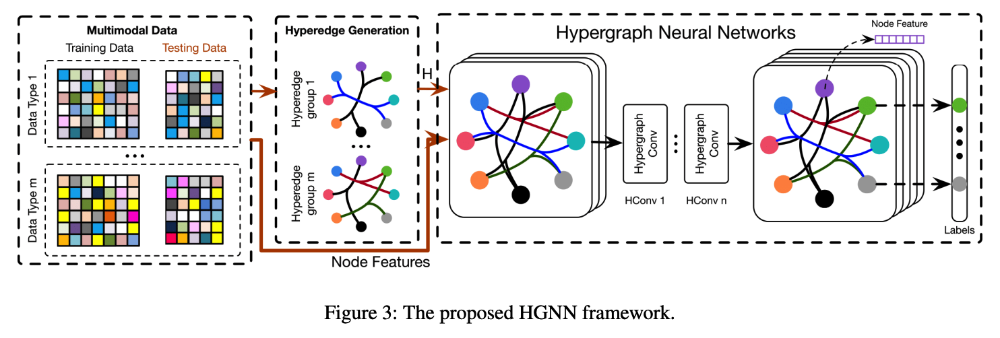

# awesome-GNN
关于图神经网络的一些工作总结

## 图神经网络的更新方式除了一下全部aggregate以外，还可以按照分阶段来处理。
比如知识图谱我可以把每个三元组的进行bilinear。然后使用attention来搞。

# 1.Hypergraph Neural Networks@AAAI2020
high-order data correlation(更加flexible)
## Motivation:
1.主要就是high-order data correlation@

## 我们的技术核心创新
1.传统的hypergraph learning过程可以通过本文提出的hyperedge convolution进行优化～

## introduction介绍方式
就是说传统的gcn就是pairwise connections among data are employed，但是事实上data structure in real practice could be beyond pairwise connections and even far more complicated。

尤其是针对多模态数据，整个情形就会变得更佳复杂。

1.data correlation比起pairwise relaionship而言是很复杂的。

2.而且对于异质信息网络而言，传统的GCN就有它的limitation to formulate the data correlation；

3.咱们的HGNN比起传统的edge degree@mandatory 2，我们的可以encode high-order data correlation。

4.hypergraph在cv中很常见，但是由于其很高的计算量，所以wide application就limited了。

GCN可以看作是HGNN的一个special case。

### TODO 这里的公式太spectral了

# 2.Hypergraph Attention Networks for Multimodal Learning
## 1.Motivation:
1.在这个传统的过程中，我们表示align the information level of 异质模态是一个基础的任务@多模态学习

2。我们这里就是创建hypergraph来学习alignment～

# 3.Event Detection with Multi-order Graph Convolution and Aggregated Attention
这里的核心就是找到一个event trigger（main word to the 对应的event，依靠这个词就可以分类出这个话到底是什么类型的event，比如fired就是attack）
## Motivation:
1.这里就是前人工作使用的dependency tree的话，就是trigger words和related entities的syntactic relations可能是first-order的，也可能是high-order的。而且，据统计，51%的是高order的。

2.虽然目前的使用high-order都是stack more GCN layers。但是事实上oversmooth就有问题。那么我们搞几个～

3.我们就是同时使用first-order和high-order的graph来encoding，其中使用GAT来自适应决定邻居words的weight～

## 工作内容
### 1.Word Encoding
word embedding+entity type embedding+POStagging embedding

BiLSTM
### 2.Multi-order graph attention network
首先关于A有三个sub matrixs，他们的shape都是nxn的，Aalong,Arev,Aloop. along呢，就是如果这儿在dependency tree中有dependency arc的话，就有1@Aalong。Arev就是Aalong的转置矩阵～
Aloop就是identity matrix。

然后咱们这里额外搞了几个k-th order syntactic graph。就是edge仍然是三种，不过along的就是变成了之前的k-order。

计算的时候就是GAT自适应学习，然后element-addition就行～那么我们这里设置的K=3.

# 3. Learning Multi-Granular Hypergraphs for Video-Based Person Re-id
### introduction介绍方式
this work aims to .In this sense.

对于person re-id而言，multi-granular的spatial relation和multi-granular 的temporal relation都是十分重要的～
