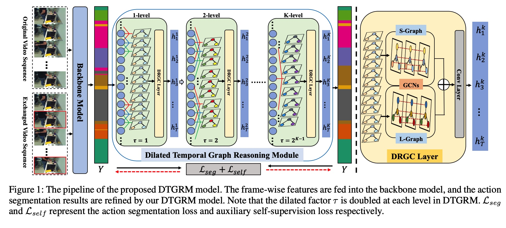

# awesome-GNN
关于图神经网络的一些工作总结

## 图神经网络的更新方式除了一下全部aggregate以外，还可以按照分阶段来处理。
比如知识图谱我可以把每个三元组的进行bilinear。然后使用attention来搞。

# 1.Hypergraph Neural Networks@AAAI2020
high-order data correlation(更加flexible)
## Motivation:
1.主要就是high-order data correlation@

## 我们的技术核心创新
1.传统的hypergraph learning过程可以通过本文提出的hyperedge convolution进行优化～

## introduction介绍方式
就是说传统的gcn就是pairwise connections among data are employed，但是事实上data structure in real practice could be beyond pairwise connections and even far more complicated。

尤其是针对多模态数据，整个情形就会变得更佳复杂。

1.data correlation比起pairwise relaionship而言是很复杂的。

2.而且对于异质信息网络而言，传统的GCN就有它的limitation to formulate the data correlation；

3.咱们的HGNN比起传统的edge degree@mandatory 2，我们的可以encode high-order data correlation。

4.hypergraph在cv中很常见，但是由于其很高的计算量，所以wide application就limited了。

GCN可以看作是HGNN的一个special case。

### TODO 这里的公式太spectral了

# 2.Hypergraph Attention Networks for Multimodal Learning
## 1.Motivation:
1.在这个传统的过程中，我们表示align the information level of 异质模态是一个基础的任务@多模态学习

2。我们这里就是创建hypergraph来学习alignment～

# 3.Event Detection with Multi-order Graph Convolution and Aggregated Attention
这里的核心就是找到一个event trigger（main word to the 对应的event，依靠这个词就可以分类出这个话到底是什么类型的event，比如fired就是attack）
## Motivation:
1.这里就是前人工作使用的dependency tree的话，就是trigger words和related entities的syntactic relations可能是first-order的，也可能是high-order的。而且，据统计，51%的是高order的。

2.虽然目前的使用high-order都是stack more GCN layers。但是事实上oversmooth就有问题。那么我们搞几个～

3.我们就是同时使用first-order和high-order的graph来encoding，其中使用GAT来自适应决定邻居words的weight～

## 工作内容
### 1.Word Encoding
word embedding+entity type embedding+POStagging embedding

BiLSTM
### 2.Multi-order graph attention network
首先关于A有三个sub matrixs，他们的shape都是nxn的，Aalong,Arev,Aloop. along呢，就是如果这儿在dependency tree中有dependency arc的话，就有1@Aalong。Arev就是Aalong的转置矩阵～
Aloop就是identity matrix。

然后咱们这里额外搞了几个k-th order syntactic graph。就是edge仍然是三种，不过along的就是变成了之前的k-order。

计算的时候就是GAT自适应学习，然后element-addition就行～那么我们这里设置的K=3.

# 3. Learning Multi-Granular Hypergraphs for Video-Based Person Re-id
### introduction介绍方式
this work aims to .In this sense.

对于person re-id而言，multi-granular的spatial relation和multi-granular 的temporal relation都是十分重要的～

# 4. Sentence Specified Dynamic Video Thumbnail Generation
Video Thumbnail 就是和视频摘要差不多～

Video Thumbnail Generation就是产生video content preview预演，这个对于影响users' online searching experiences~

这里就是提出一个新任务。不仅是生成Video Summarization还要针对用户的个人兴趣来自动生成～（多模态）
## 1.Motivation:
1.传统的video thumbnail仅仅只是利用了视觉特征@video，而没有user的搜索意图不能提供一个有意义的snapshot简介 of the video contents that users concern.

2.我们提出的模型GTP就是利用sentence specified video graph convolutional network@建模both 句子-视频 语义interaction以及内部的视频关系@结合sentence information。（基于temporal conditioned pointer network）（就是一种graph之前做了一个匹配的操作～）

# 5. Temporal Dynamic Graph LSTM for Action-driven Video Object Detection@TD-GraphLSTM

# 6. Object-Aware Multi-Branch Relation Networks for Spatio-Temporal Video Grounding
## 1.Motivation
1.许多现有的Grounding work都是局限于well-aligned segment-sentence pairs～那么我们的工作就是unaligned data and multi-form sentences.

2.这个任务就是需要capture重要的object relations去identify the queried target.

3.但是现有的办法无法区分出notable objects以及关系建模还不是那么有效@针对不重要的对象～

## 2.我们的Contributions@我们提出一个创新性的object-aware multi-branch relation network@object-aware relation discovery.
1.我们就是设计了multiple branches去发展object-aware region modeling（每个branch都关注一个crucial object in 句子）

2.然后我们就是提出一个multi-branch relation reasoning去捕捉关键object 关系@main branch以及附属branches～

3.除此以外，我们使用了一个diversity loss去确保每个branch只关注自己应该关注的corresponding objects。

# 7.Zero-Shot Video Object Segmentation via Attentive Graph Neural Networks
这里就是一个全连接图，然后relations between 绝对frame pairs作为边～

这个潜在的对关系就是使用注意力机制来进行迭代更新

实验结果证明我们的网络可以发现到常见的对象objects

# 8.Reasoning with Latent Structure Refinement for Document-Level Relation Extraction
## 本文基于的工作
文档级别的关系抽取就需要集中信息within and across多个句子@document，然后捕捉句子之间的entity之间的复杂的交互～

但是有效聚合文档中的相关信息是一个很有挑战性的研究问题～

## Motivation:
1.现有的static document-level的graphs往往基于语法树，co-references 或者heuristics from the unstructured text去建模依赖～（co-reference指代，heuristic启发性的）

2.但是这种类型的方法往往不能捕获rich non-local interactions@inference～

这种问题就是entity和enity的关系理解需要理解几句话，并且进行相应的multi-step reasoning～

## 关于我们如何创建这个node～

# 9.Temporal Relational Modeling with Self-Supervision for Action Segmentation@AAAI2021 对video中的所有frame都进行建模的一种方法～
## 1.Motivation:
1.GCN在视频中关系建模有很大的意义，但是事实上对于long video sequences而言使用GCN还是很苦难的～（主要的原因就是**large number of video frames@nodes让GCN很难caoture and model temporal relations in videos**）（本文的设计就是DTGRM@Dilated Temporal Graph Reasoning Module）

2.我们的方法就是可以model temporal relations and dependencies between video frames **at various time spans**.

我们这里就是multi-level dilated temporal graphs where the nodes代表frames from 不同的moments in videos～（而且这里还有一个**auxiliary self-supervised task is proposed to find and correct wrong temporal relations in videos**）

这里呢其实就是旨在temporally locating以及识别human action segments in long untrimmed videos～**对于action understanding而言，这是一个更加challenging的task**

## Introduction@claim
首先介绍了一下human action understanding这个任务的意义，然后介绍了什么是action segmentation，接着就是讲了一下目前action segmentation的一些工作，指出其实对于action segmentation而言，**In fact, temporal relations in various timescales (i.e., short-term and long-term timescales) are all of importance to infer action label of each frame**

1.因此我们需要一个various timescales的temporal relation建模～

2.那么我们就提出了一个Dilated Temporal Graph Reasoning Module**DTGRM**,同时这里为了增强这个temporal reasoning ability of the proposed model，我们还可以使用一个附属的self-supervised task去识别wrong-ordered frames in video and predict the correct action labels for them.

-multi-level dilated temporal graphs on video frames去effectively model temporal relations@各种各样的timescale。然后计算两种complementary edge weights去指导temporal relational reasoning with GCNs.
-An auxiliary self-supervised task is proposed to enforce the proposed model focus on temporal relational reasoning.@(alleviate the over-fitting)~

## Action Segmentation是什么样的任务呢？
这里的核心就是我们针对T frames的每个frame都要做一个分类，有的类别属于background class(no action)~

## 关于Dilated Temporal Graph Reasoning Module
以前的工作一般是专注于基于action proposals或者action segments来创建graph（**这里一般是基于其他模型进行pre-computed以及mostly inaccurate**）
-那么我们的工作就是直接用frame来进行建模，对于这个large graph的问题使用multi-level dilated temporal graphs。

1.这里的就是说successive frames总是belong to the same action class and long-range temporal relations就是不同的action class之间的关系～

2.但是直接在所有的frames上进行训练以及优化是十分困难的。

### 创建方法
Suppose we have a total of T frames in video and the dilated temporal graphs at k-th level就是基于dilation factor t_k来进行construct的。那么对于timestep t，它的dilated 邻居frames就是被当作是temporal graph的node了，然后vertices就是3.**（t-t_k,t,t+t_k）**

我们的核心就是创建一个3张frame构成的graph，然后对于k-th level我们就是为了减轻noise problem in single constructed graph，我们计算了两个互补的edge weights@dilated temporal graph～(S-Graph + L-Graph)

### S-Graph
创建这个的核心思想就是nodes with similar action class的应该有larger edge weights。因此我们可以首先使用1个1x1的卷积层来transfer action class

# 9.Temporal Relational Modeling with Self-Supervision for Action Segmentation中
# 9.Temporal Relational Modeling with Self-Supervision for Action Segmentation

