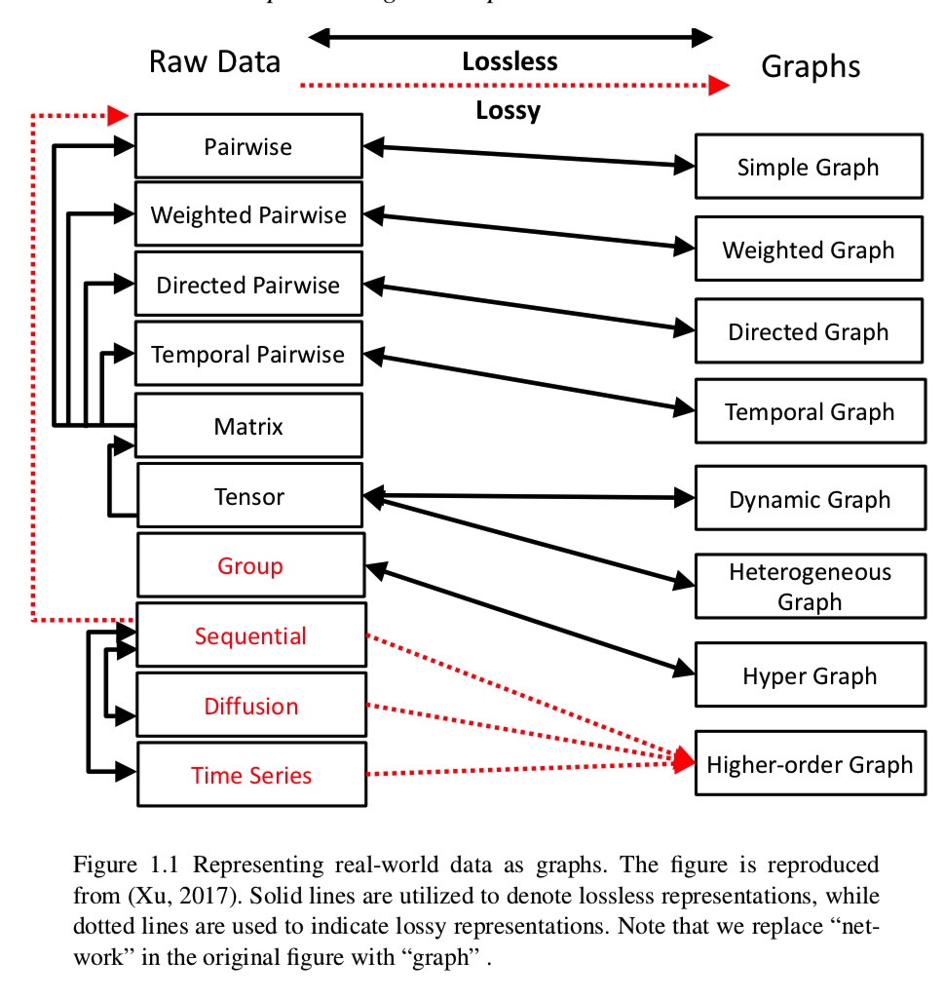
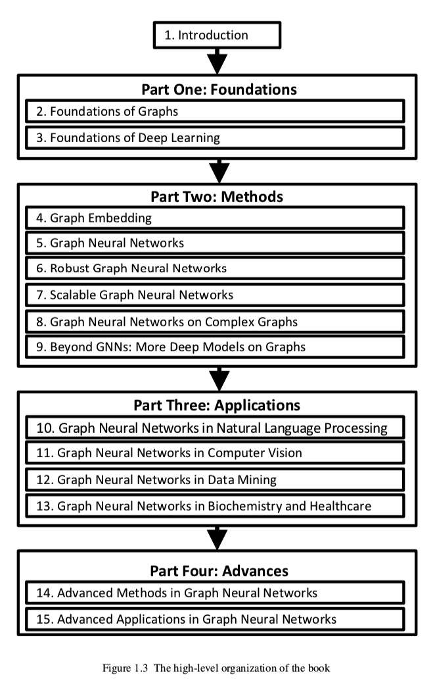
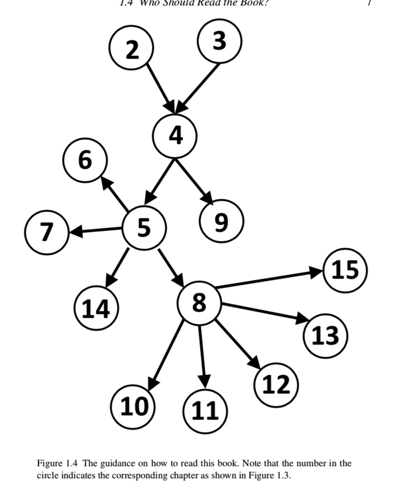

# 1.2. 一个问题：为什么我们想要尝试图上的深度学习？
Motivation包括2点。

1.graphs 提供了一个universal representation of data～（许多数据都是graph类型的）

2.numerous other types of data can be transformed into 图结构数据。

3.许多现实世界的任务可以当作图上的计算任务来解决。

**比如推断节点属性/检测异常节点spammers+terrorists/识别对于疾病而言相关的genes/将医药给对应的人@@节点分类。**

**推荐/polypharmacy side effect prediction/drug-target interaction identification/知识图谱补全都是link prediction的任务。**

## 1.2.1 传统的机器学习并不适合图数据，为什么呢？
因为他们假设数据都是independent+indentically distributed。

这儿有两种directions to develop solutions～

*我们这里使用节点分类来作为这个讲解的任务。*



1.就是咱们的collective classification。

这个一般就是半监督算法，用已知节点的label来分配其他节点的label。

2.就是咱们的set of features，然后结合传统的ML算法来进行分类。（这种最常见）。

## 传统的dl在Graph上的挑战
1.数据是unordered+distinct neighborhood。

2.structural information for regular data is simple～（但是图数据的话就有各种各样的graph）

**nodes and edges can associate with rich side information**，而传统的深度学习无法capture这种复杂的信息。

# 1.3 What content is covered。



这个是建议的ladder。


# 1.5 Feature Learning on Graphs: A Brief History

就是如果想要利用传统机器学习，我们要做的事情就是find vector node representations。

```
1.feature engineering:手工设计的特征比如node degree statistics。但是我们没有先验知识到底哪个是重要的。所以需要耗费巨大的人力。
2.feature learning:自动适合下游任务。
```

对于feature learning我们粗略将其分为两种任务。

1.feature selection，比如旨在去除无关的node features。

2.representation learning@@生成一系列的new node features。


# 1.5.1 Feature Selection on Graphs

特征选择的目的就是automatically select a small subset of features that have minimal redundancy but maximal relevance to the target～

传统的feature selection就是假设数据都是独立的+iid，但是事实上samples in many applications are embedded in graphs，而不是iid，

1.早期就是对于node set的每一个node都是降维。


3.representation learning@@生成一系列的new node features。


TODO

因为技术了解不够深厚，很难产出有意义的文章，


