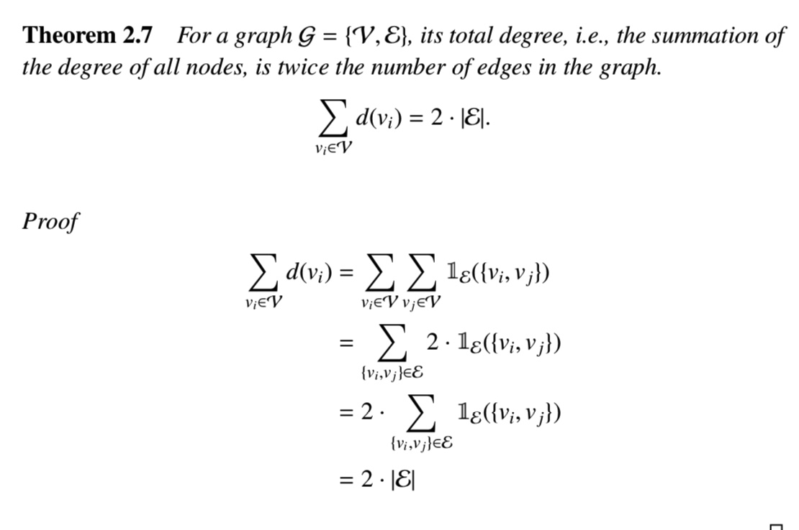

```
1.normal graphs
2.heterogeneous graphs
3.bipartitie graph
4.multi-dimensional graph
5.signed graph
6.hypergraph
7.dynamic graph
```
# 2.2. Graph Representations
基本图的定义+complex graphs

对于无向图而言，邻接矩阵是对称的。

# 2.3. Properties and Measures

## 2.3.1 Degree

首先是每个节点的入度和出度计算方式必须学会。

### total degree for graph
这个就是所有节点的degree的总和。是graph的edges数目的两倍。



### 一个节点的度也可以根据自己的邻接矩阵来计算。


### 接矩阵上的非零元素是edges的数目的两倍～

## 2.3.2 Connectivity
这个是一个很重要的属性，在讨论这个之前，我们先讨论walk和path。

### walk
这个就是一个交替序列：点边点这样的模式。

比如u-w walks就有很多个。只是标清楚了起点和终点而已。其中这些walks并不是unique的，因为存在各种各样长度的walks。（长度就是边的数目0

**Trail**：这个就是一个walk whose edges are distinct；

**Path**：这个就是一个walk whose nodes are distinct。

### n-th power of the adjacency matrix:（这个就是邻接矩阵幂次的意义）*核心*
这个就是A^n中的每个元素都是比如i-j就是vi-vj长度为n的walks的数目。

这里可以用科学归纳法来证明。

### 定义：subgraph要求一定是connected component
而且仅仅是一个connected component，两个就是两个subgraph了。

### 定义：shortest path
就是两点之间的最短的路径，这个可以存在若干个。

**最短路径是图的一个很重要的特征，比如graph的diameter就是最长的最短路径。**

## 2.3.3 Centrality
这个就是描述了一张图中节点的重要性。这儿有多种方式来描述节点的重要性。

### Degree Centrality
这个就是直觉上，描述一个节点是否重要，就是看到底有多少其他节点和他是connect的。（我们可以测量他的centrality根据他的degree）。

这里就是使用度来计算。


TODO Page24.

# 2.6 Complex Graphs
前面的sections，我们介绍了simple graphs以及他们的基础属性。但是现实世界中的图往往更佳复杂。

## 2.6.1 Heterogeneous Graphs
最简单的图就是homogeneous的，比如single type of nodes+edges。

### 一个简单的例子@academic network describing publications and citations

nodes有三种:
```
authors/papers/venues.venue是聚会地点。
```

也有各种各样的relations。，比如paper和author的authorship relation。

### 异构图定义：
这个就是每个节点和每个edge都有对应的type。（以及对应的两种mapping function，一个针对node，一个针对edge）

## 2.6.2 Bipartite Graphs@电子商务很常见
这个就是node set可以划分为两个disjoint subsets。然后边仅仅存在两者之间，而不存在两者之内。

### 例子：amazon这种e-commerce platforms。
那么用户的点击历史就是可以这么建模，其中users+items就是对应的两个sets。click行为就是对应的边。

## 2.6.3 Multi-dimensional Graphs
这里就是node和node之间可以存在多种关系。

### 例子
1.video-sharing sites，比如users之间存在多种relation，比如subcribe是一种，然后users也可以通过其他的关系比如sharing或者commenting videos from each‘ others。

2.电子商务网站比如Amazon，users和items有多种方式可以交互，比如click/purchase/comment。（那么这里就是考虑each type of relation as one dimension）。

### 定义：multi-dimensional graph
这个就是D个邻接矩阵。对于dimension 而言。

## 2.6.4 Signed Graphs
这个图就是包括positive and negative edges。**online social networks**。

比如说Facebook和Twitter，users可以block others。（这种block操作就可以当作一个negative edge）。

unfriend也可以当作。、
、
### 定义：signed graphs
这个就是两个edge sets。但是我们需要注意的就是edge又可以变成positive的，还可以变成negative的。交集为空集。

邻接矩阵只有一个，positive或者negative就是1/-1.

## 2.6.5 Hypergraphs
上述的graph仅仅就是encode pairwise information via edges。但是事实上现实世界很多超过了两者之间的relation。

### 例子：
A specific author can publish more than two papers。

因此一个author可以被看成a hyperedge connecting multiple papers。

**graphs with hyperedges are called as hypergraphs**

### 定义Hypergraph：这个定义比较复杂。


这里的理解比较困难。

## 2.6.6 Dynamic Graphs
这个就是node和edge都是动态出现的。

### 例子
比如online social networks比如Facebook。

这种graph可看成是每个node‘或者edge都和一个timestamp相互联系。

**尤其是每个edge都和一个timestep相互联系，其中node的timestep就是the first edge出现的那一刻。**

### 定义：动态图
这里就是每个node和edge都对应一个timestep。其中有两个mapping function，就是将对应的node和edge都映射到他们emerging timesteps。

但是事实上**我们并不能够record the timestamp of each node/edge。相反，我们只是check from time 2 time去观察图是怎么evolve的。

我们在每个timestamp t，我们都记录它的snapshots of the graph as the observation。

**这种就叫做discrete dynamic graphs，这个就是由多个graph snapshots而组成的。**

### 定义二：离散动态graphs
这个就是由T个graph snapshots来做的。

# 2.7. Computational Tasks on Graphs
主要可以分为两类。

1.node-focused tasks

**这个一般是将所有的/entire data表示成一个graph，其中node就是data samples。**

2.graph-focused tasks

**我们的数据往往是一系列的图，然后每个data sample都是一个graph**

- 下面就是介绍一些典型的task。

### 2.7.1 Node-focused tasks
这种就有很多任务啦，比如节点分类/节点排序/link预测/群落检测。
这里我们主要讲两个任务，比如node classification 以及link prediction。

### 2.7.1 Node-focused tasks
#### 首先是关于节点分类的任务
我们这里就是现实世界来预测节点的属性而言是很有意义的，比如说找到社交媒体上的labels related to interests和hobbies可以用来推荐相关的商品给对应的使用者。

但是**现实世界中，facebook差不多少于1%的users提供了对应的labels。那么我们做的事情就是推断labels for nodes without labels。**

这个就促进了节点分类任务的发展。

### 节点分类任务的定义
这个就是部分有label，然后我们所做的事情就是预测没有label的mapping。然后这个对于simple graphs的定义可以直接延伸到graphs with attributes and complex graphs ～！

### 一个example for Flickr@节点分类可以当作推荐任务～

这个平台就是image hosting platform 允许使用者来host their photos～

这里面的users可以相互follow～

**相互follow/这种connection可以当作是一个graph**

1.这些users可以follow一些有趣的group。这个就表示了使用者的兴趣。可以当作labels。（尤其是可以**多个group，当作multi-label classification～**

2.这种multi-label 分类任务可以帮助预测potential groups that users are interested in·～～～

### 2.7.2 Link Prediction
现实世界的图可能还有一些edge是缺乏的。（这个就导致一些graph里面存在miss edges的～）

于此同时，许多graphs一直在evolving的。

### 例子：
1.FB，使用者可以持续和他人成为朋友的。

2.学术合作图，一个author可以持续build new collaboration‘relations with each other～

### 这个link prediction的应用
1.friend recommendation；

2.knowledge graph completion

3.criminal intelligence analysis

### 定义：
这个就是预测那些不存在的edge有多可能exist。/emerge in the future～

这个还可以延伸到complex graphs，比如**signed graphs-》还要预测对应的符号/hypergraphs就是预测对应的多个nodes之间的relation**

### 一个实践例子@DBLP
比如co-authorship graph来预测两个人是否将来会有合作。

## 2.7.2 Graph-Focused Tasks
比如图分类/图匹配/图生成。

### 这里我们介绍最典型的图分类任务

这个任务不能直接用传统的分类器。预测是否是enzyme就是一个典型的工作～


